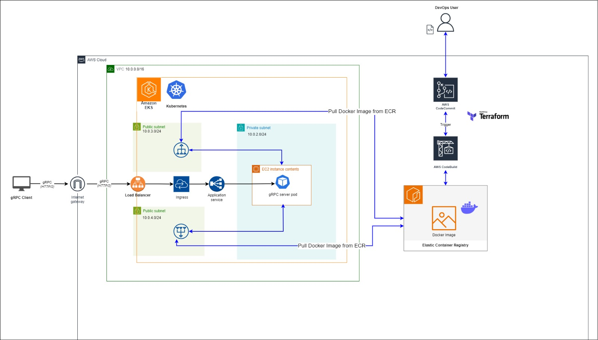

# Technical Test: DevOps

## Table of Contents

- [About](#about)
- [Getting Started](#getting_started)
- [Infrastructure](#infrastructure) 

## About <a name = "about"></a>

 Python application leveraging gRPC (Google Remote Procedure Call) technology on Amazon EKS (Elastic Kubernetes Service) within the AWS (Amazon Web Services) cloud environment. The application utilizes gRPC for efficient communication between microservices, allowing for high-performance and language-agnostic interactions. 

 The infrastructure of the application was built using terraform. It includes two modules (networking and EKS). The application is exposed through an AWS ingress, using a ALB. The application is containerized on a docker image, stored in an Amazon ECR, which is then used to create the pods within the EKS.

<BR>

## Getting Started <a name = "getting_started"></a>

These instructions will get you a copy of the project up and running on your local machine for development and testing purposes. See [infrastructure](#infrastucture) for notes on what the terraform code creates under the hood.

### Prerequisites 

An AWS account with appropriate permissions to create resources.
AWS CLI installed and configured with access keys.
Terraform installed locally for infrastructure provisioning.
CodeCommit repository for storing application code.

### Infrastructure Setup

1. Clone the Repository:
````
git clone https://github.com/NicolleMayol/gRPC-Application
````
2. Navigate to the Infrastructure Directory:
````
cd ./gRPC-Application/infrastructure
````

3. Update the CodeCommit repository url (found on the main.tf file) to point to your personal repository
````
codecommit_repo_url = "https://git-codecommit.us-east-1.amazonaws.com/v1/repos/simetrik-test"  ## UPDATE WITH YOUR CODE COMMIT REPOSITORY
````

4. Initialize Terraform:
````
terraform init
````

5. Generate Terraform Plan:
````
terraform plan -out plan
````

6. Apply Terraform Plan:
````
terraform apply plan
````

### Application Setup

1. Push the application code to your CodeCommit repository

2. Run the CodeBuild pipeline

### Test the application

Test the application following these steps:

1. Update the crypto_client.py file to point to your AWS ALB DNS NAME

2. Run 
````
python ./app/crypto_client.py
````

<BR>

## Infrastructure <a name = "infrastructure"></a>



### Networking

The project infrastructure is built on Amazon Web Services (AWS) and consists of the following components:

#### Virtual Private Cloud (VPC):
Provides isolated networking environment for our resources.
* CIDR Block: 10.0.0.0/16
#### Subnets:
`Public Subnets:`
Hosts resources accessible from the internet.
* CIDR Blocks: 10.0.3.0/24, 10.0.4.0/24

`Private Subnet:`
Hosts resources that require internal communication only.
* CIDR Block: 10.0.2.0/24
#### Internet Gateway (IGW):
Facilitates internet connectivity for resources in public subnets.
* Route Tables:
    * Public Route Table:
            Routes internet-bound traffic to the IGW.
#### Security Groups:
* Allow All:
    Controls inbound and outbound traffic for resources.
#### Amazon EKS Cluster:
Managed Kubernetes service for containerized applications.
* Cluster Name: simetrik-cluster
* Version: 1.24
#### Application Ingress (ALB):
Acts as the entry point for incoming traffic to our application.
Listens on port 50051 and routes traffic to the EKS cluster.
#### CI/CD Pipeline (AWS CodeBuild):
* Automates the build and deployment process of the application to the EKS cluster.
* Integrates with the version control system (CodeCommit)
* Automates the deployment process of the infrastructure 

<BR>

## Authorship
This project was authored by Nicolle Mayol. Contributions, issues, and feedback are welcome. Feel free to reach out to the author via email for any inquiries related to the project